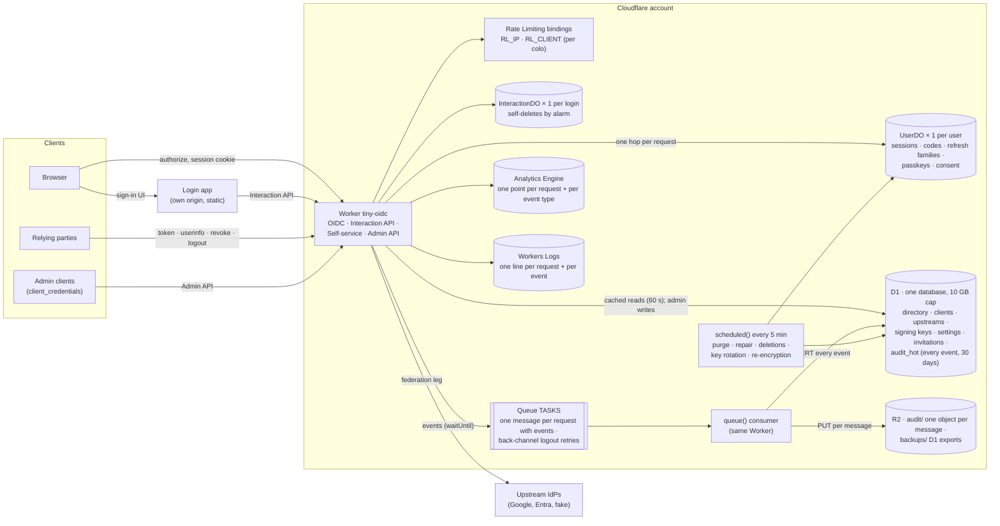
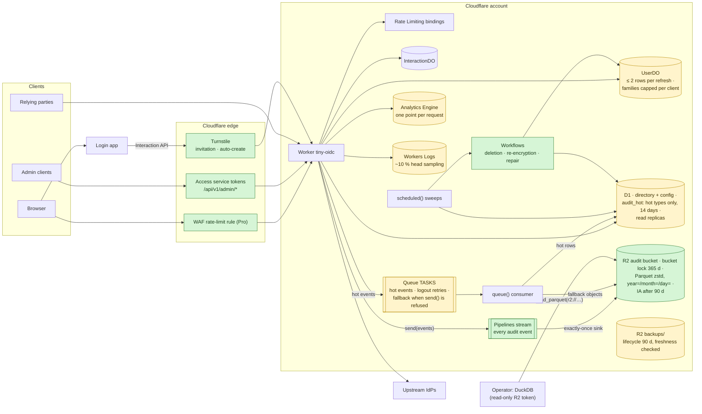

# Platform and specification review — 2026-09-26

Written for the repository owner, who decides; and for whoever later changes
the architecture. It records what a week of staging runs, a survey of
Cloudflare's current products and an audit of the specification found, and
what is proposed. Nothing here changes the specification by itself: each
proposal becomes an ADR and a plan row when the owner decides it.

| Status | |
|---|---|
| Done | Privacy fix (P7-10, ADR 0020, commit `c9299ec`) |
| Proposed | ADR 0019 (audit capacity), to be rewritten as "audit storage and telemetry" after the Pipelines test (§7) |
| Pending | The owner's decisions in §8 |

## 1. Summary

- **The audit and telemetry pipeline cannot run at the specification's target
  scale.** At the §2.7 rates (100,000 daily active users) it writes 6.2 M D1
  rows a day. That fills D1's 10 GB database, which cannot be raised, in about
  three days, and outruns the cron's purge. The load gate that should have
  caught this measured the wrong thing (§4, H2).
- **§2.7's cost line is wrong by an order of magnitude.** It says ~$185 a
  month. The design as built costs **~$2,400–5,200 a month** at the target, of
  which the service itself (Workers and Durable Object requests) is ~$120–140.
  The rest is audit, logs, metrics and per-refresh storage writes (§3).
- **Better products exist for the audit record.** The proposed design:
  - Cloudflare Pipelines writes Parquet into an R2 bucket under a bucket lock,
    so the record is write-once.
  - DuckDB reads it directly for investigations, with no Iceberg and no
    DuckLake.
  - A small D1 table keeps only the events the API reads back.

  Estimated at **~$360–620 a month** (§5, §6). Pipelines is in open beta and
  its failure behaviour is undocumented, so it is tested before anything is
  decided (§7).
- **The specification promised properties nothing enforced.** Erasure,
  "immutable" archive objects, capacity figures and per-user storage bounds
  were among them. The privacy part is fixed (ADR 0020); the rest are listed
  with the test or mechanism each needs (§4).

## 2. How the components interact today

Deploys: Workers Builds runs a staged rollout (ADR 0018) on every push to
`main` (staging). GitHub Actions runs the gates on push and a nightly suite
(conformance, load, mutation, weekly soak) against staging.

## 3. What the design costs and holds at the target scale

The target scale (spec §2.7): 1,000,000 users, 100,000 daily active,
~10 M requests, ~200,000 interactive logins and ~5 M refresh rotations a day.
Prices were read from Cloudflare's pages on 2026-09-26 (§9). Sizes were
measured on staging data with the repository's schemas.

| Line | What drives it | Today's design, per month | §2.7 says |
|---|---|---|---|
| Workers requests | 10 M requests/day | ~$92 | ~$90 |
| Durable Object requests | one hop per request | ~$30–45 | ~$25 |
| **Durable Object rows written** | a refresh runs 4 writes (consume, insert, family, session), 6–9 rows with index rows and the later purge (M1) | **~$560–1,320** | not counted ("storage ~$20") |
| Durable Object storage | ~200 KB per user measured, not ≤ 40 KB (M2) | ~$40 | ~$20 |
| **D1 audit writes** | 6.2 M rows/day, 2–6 rows written each with the indexes, plus the purge | **~$320–2,180**, and D1 full in ~3 days | < $10, "3× headroom" |
| **Queue** | 5.8 M messages/day × 3 operations | **~$208** | ~$40 |
| **R2 Class A** | one object per message | **~$779** | — |
| **Workers Logs** | one line per request + per event (~16–22 M/day) | **~$280–390** | — |
| Analytics Engine | ~16 M points/day; not billed yet, prices published | ~$120 once billed | — |
| **Total** | | **~$2,400–5,200** | ~$185 |

What this rests on (ADR 0019 has the detail):
- `audit_hot` measured **533 bytes a row** (608 for `session.created`). A login
  emits 6 events and a refresh 1 (`test/http/audit-events.test.ts`).
- The directory measured **1.39 GB** at 1 M users, not 0.9 (M3).
- The cron purges at most **2.88 M rows a day** (TIO-CFG-010).

## 4. What the specification promised and nothing enforced

From an audit of the specification against the code, 2026-09-26. Each item
names what would enforce it. **Fixed** marks what P7-10 closed.

**High**
- **H1 — Erasure.** Admin diffs carried email and name into `audit_hot`, the
  archive and the logs. Redeemed invitations outlived the account. The cron
  ignored `used_at`. **Fixed** (ADR 0020): the test scans every D1 table and
  every log line after a deletion. What remains is documented: D1 Time Travel
  and Durable Object PITR keep 30 days and `backups/` 90 days.
- **H2 — The load gate's D1-write check reads per-request `Server-Timing`**
  (`perf/scenarios/token_refresh.js:49`). It cannot see the queue consumer's
  inserts. TIO-TEST-051 says the rate comes from `/admin/stats` deltas.
  **Enforce:** implement the delta, `audit_hot` included.

**Medium**
- **M1 — Refresh storage writes.** 4 SQL writes per refresh (`UserDO.ts`
  consume, insert, family update, session touch), ~$560–1,320 a month.
  **Enforce:** measure rows written on staging; target ≤ 2 per refresh, for
  example no session touch when `last_seen_at` is recent.
- **M2 — Per-user storage ~200 KB, not ≤ 40 KB.** The empty schema alone is
  ~164 KB (one 4 KB page per table and index). Nothing caps refresh families
  per user. The soak's storage check reads an export that omits
  `refresh_tokens`, `auth_codes` and `challenges`. **Enforce:** report
  `databaseSize` in counts, cap families per (user, client), and a component
  test of row counts after 48 h of rotation.
- **M3 — The directory estimate is 1.39 GB, not 0.9 GB.** **Enforce:** the
  capacity test derives it from the migrations.
- **M4 — `/admin/audit/archive` builds one unbounded list** of up to 31 days of
  keys (today ~5.8 M a day). **Enforce:** a limit and cursor.
- **M5 — `/admin/audit` filters on `actor_id` and `outcome` have no index**,
  against §9.2's "indexed columns only". **Enforce:** an `EXPLAIN QUERY PLAN`
  test per filter.
- **M6 — `POST /admin/users/{id}/restore` revives revoked sessions and
  consumed tokens and rolls back passkey counters.** Its success path has
  never run in a test. **Enforce:** revoke everything issued before the
  restore time, keep the highest counter, reindex.
- **M7 — R2 lifecycle rules and the weekly D1 backup are runbook steps that
  nothing checks.** **Enforce:** the deploy script verifies the lifecycle
  rules; a nightly check that the newest `backups/` object is under 8 days
  old.
- **Already known — the archive is called "immutable" (§4.5) and nothing
  makes it so.** The consumer overwrites by key, and no bucket lock exists.
  **Enforce:** the lock in §5.

**Low**
- Hash comparisons with `!==` where TIO-CRYPTO-003 wants constant time: five
  sites, not exploitable (256-bit secrets). The WebAuthn challenge in a
  registration failure reason is **fixed** in P7-10.
- §4.5's "≤ 128 KB" queue message does not hold for 50 events of 4 KB.
- Queue peak and headroom are understated (~7×, not 15×).
- A cron-finished deletion emits no `user.deleted` and sends no back-channel
  logout.
- The PRIV-001 schema test omits the invitation and `audit_hot` columns.
- §6.7's limits differ from production's (ADR 0001) without the threat table
  saying so.
- **Review-only requirements that could be tests:**
  - TIO-ARCH-001 (the module's exports).
  - TIO-DEPLOY-001: the top-level profile and production share the Worker
    name `tiny-oidc`.
  - TIO-DEPLOY-004 (runbook headings).
  - TIO-DEPLOY-003 (backup freshness).
  - TIO-DEPLOY-006 (no Cloudflare token in workflows).
  - TIO-DEPLOY-009 is already enforced by the config check.

**Why these were missed.** The audit path was designed from the bindings
already chosen, without a survey of the platform's products. The capacity and
cost lines, "immutable" and "random id only" were stated without a test or
mechanism behind them. From now on, every storage or transport decision lists
the platform's current products with verified status and prices, and every
claim of that kind gets a test (TIO-PERF-003 in ADR 0019 is the first).

## 5. Product survey — current Cloudflare offerings against our choices

Verified on 2026-09-26 unless marked; sources in §9.

| Our need | Candidate | Status | Verdict | Why |
|---|---|---|---|---|
| Audit record | **Pipelines → R2 sink (Parquet, zstd, `year=/month=/day=`)** | Open beta, billed since 2026-08-03 | **Adopt, after §7** | Ingest free. Sinks $0.06/GB of uncompressed Parquet after 50 GB, so ~$3–10 a month. Sinks are "exactly-once" and one stream can feed several sinks. Rejection behaviour of `send()` is undocumented; invalid events are "accepted but dropped". |
| Write-once archive | **R2 bucket lock** (+ move to Infrequent Access after 90 days) | Available | **Adopt** | Prevents delete and overwrite for an age, a date or indefinitely, above lifecycle rules. The Worker's binding cannot lift it; an account admin can. |
| Querying the archive | **DuckDB over `r2://` with a read-only token** | DuckDB 1.5.5 | **Adopt** | Hive-partition pruning on the paths. No catalog, no maintenance, compatible with the lock. Runs on an operator machine or a Container. |
| | Iceberg + R2 Data Catalog + R2 SQL | Public / open beta | **No** | Maintenance deletes files (conflicts with the lock). R2 SQL has no Worker binding and needs an admin-scoped token. |
| | DuckLake 1.0 | Released Apr 2026 | **No** | Takes ownership of registered files and deletes them in maintenance. Needs a catalog database. Open bug with externally written files. Adds nothing to an append-only log. |
| Request logs | **Head sampling ~10 %** and no per-event lines | Available | **Adopt** | ~$6 a month. Logpush → R2 at ~$15 if every request must be kept. |
| | OpenTelemetry export, tracing | Beta; tracing billed from 2026-10-01 | **No** for now | Keep tracing off. |
| Metrics | Analytics Engine, one point per request | Not billed yet | **Keep, trim** | Audit-type counts come from the archive instead. |
| Long maintenance jobs | **Workflows** | GA | **Consider** | Resumable steps for deletion, master-key re-encryption and repair. Not for logout retries (~$44 against ~$4 on the queue). |
| Directory reads | **D1 read replication** | Unclear (docs unlabelled, changelog "beta") | **Consider** | Free replicas near users; writes stay on the primary. |
| Per-user restore | Durable Object PITR | GA | **Adopt only after M6** | 30 days. |
| Floods before the Worker | **One WAF rate-limiting rule** | Pro plan $20–25 a month | **Consider** | Per data centre like the binding, but it runs before the Worker. The docs advise against IP-keyed Rate Limiting bindings, which `RL_IP` is: record the choice in §6.7. |
| Bots where state is created | **Turnstile** on invitation redemption and federated auto-create | Free | **Consider** | Changes the login-app contract; not on every passkey login. |
| Admin API perimeter | **Access with service tokens** on `/api/v1/admin/*`; Access on previews | Available | **Consider** | Two-header mode only (the one-header mode takes `Authorization`). The deploy smoke test needs a token. |
| Invitations by mail | Email Sending | Public beta, $0.35 per 1,000 | **Consider later** | Not for login notifications (~$2,100 a month at 200 k a day). |
| Per-branch environments | **Worker Previews** | New (2026-09-22) | **Consider** | Durable Objects isolated per preview; testing without touching staging. |
| Settings, clients, keys | Workers KV | GA | **No** | Up to 60 s or more of propagation, no read-your-writes; D1 plus the 60 s cache is stricter. |
| Key storage | Secrets Store; any KMS | Secrets Store open beta; no KMS exists | **No** | The Worker reads plaintext either way; no non-exportable signing keys on the platform. |
| Bot scores, JA4, API Shield JWT, sequence mitigation | — | Enterprise only | **No** | |
| API Shield schema validation | — | All plans, with limits | **No** | No OpenAPI 3.1 (ours is 3.1.0, 281 kB); JSON bodies only. |
| Durable Object jurisdiction | — | DO: eu, us, fedramp; D1: eu, fedramp | Note | `DO_JURISDICTION=us` could not be matched by D1 (TIO-CFG-006 accepts eu and fedramp only, which is consistent). |

## 6. Proposed architecture

Green is new and yellow is changed. What changes:
- **Every audit event goes to Pipelines**, so it reaches the locked R2 bucket
  as Parquet.
- **Only the hot types also travel the queue into `audit_hot`**, as ADR 0019
  proposes (one hot row per login, 14 days). That table is what
  `/me/events`, `/users/{id}/events` and `/admin/audit` read in milliseconds.
- **A refused `send()` falls back to the queue.** The consumer writes those
  events to the same bucket under a separate prefix. Events are unique by
  `id`, and DuckDB queries deduplicate.
- **Investigations run DuckDB against the bucket.** No Iceberg, no DuckLake.
  Pipelines' file size is raised as far as it allows. If month-long queries
  get slow, a periodic job rewrites a day into one file under another prefix;
  the locked originals are never touched.
- **Refresh writes** drop to ≤ 2 rows (M1), and **families are capped** per
  user and client (M2).
- **Logs are sampled; metrics lose the per-event points.**
- **The long cron jobs become Workflows.** The sweeps stay on the cron.
- **Edge controls are optional and decided separately:** the WAF rule, Access
  on the Admin API, Turnstile where state is created.

**Estimated cost at the target**, per month:

| Line | Cost |
|---|---|
| Workers | ~$92 |
| Durable Object requests | ~$30–45 |
| Durable Object rows written | ~$100–250 |
| Durable Object storage | ~$40 |
| Pipelines | ~$3–25 |
| R2 storage | ~$2–3 |
| Queue | ~$10 |
| D1 hot audit | ~$0–40 |
| Logs | ~$6–15 |
| Analytics Engine | ~$73 once billed |
| Pro plan, if the WAF rule is adopted | $20–25 |
| **Total** | **~$360–620** |

Against ~$2,400–5,200 today. The per-refresh write target (M1) is the least
certain line, until staging measures it.

## 7. Before deciding on Pipelines: testing `send()`

The documentation says only that `send()` "resolves when records are
confirmed as ingested". It says nothing about rejection, retries, duplicates
or buffer retention. Invalid events are "accepted but dropped". The test runs
on the Cloudflare account with a throw-away stream, sink and bucket, from a
throw-away Worker:
1. A valid batch, and a count of what lands in R2.
2. Events that break the stream's schema: resolved or rejected, and what
   lands.
3. Oversized requests (5 MB) and oversized events.
4. A burst above 5 MB/s per stream.
5. `send()` against a deleted stream.
6. A batch repeated after a failure, to see whether duplicates land.
7. The time from `send()` to a readable object at the minimum roll interval.

The results will be recorded here, and the decision on Pipelines follows
them.

## 8. Decisions for the owner

1. **Pipelines for v1**, after §7. Otherwise the generally available fallback:
   the queue with one R2 object per consumer batch, and a lock.
2. **Edge controls:** the Pro plan (WAF rule), Access on the Admin API,
   Turnstile on invitation redemption and auto-create — each yes or no.
3. **Order of the remaining work.** Proposed:
   1. H2, the gate that must see the problem.
   2. ADR 0019 rewritten as "audit storage and telemetry", with TIO-PERF-003
      covering cost as well as size.
   3. M1 and M2 (per-user writes and storage), measured on staging first.
   4. M6 (restore).
   5. M4, M5 and M7.
   6. The low items.

## 9. Sources

All pages read on 2026-09-26; "updated" is the page's own date.

- **D1:**
  - Limits (10 GB per database, "cannot be further increased"): developers.cloudflare.com/d1/platform/limits (updated 2026-04-21).
  - Pricing (rows written $1.00/M after 50 M; "at least one" extra row per index): developers.cloudflare.com/d1/platform/pricing (2026-04-21).
  - Read replication: developers.cloudflare.com/d1/best-practices/read-replication (2026-08-10).
- **Durable Objects pricing** (rows written $1.00/M after 50 M, storage $0.20/GB-month): developers.cloudflare.com/durable-objects/platform/pricing (2026-08-25). **Limits:** developers.cloudflare.com/durable-objects/platform/limits (2026-06-01).
- **Queues pricing** (3 operations per message, $0.40/M): developers.cloudflare.com/queues/platform/pricing (2026-04-21).
- **R2:**
  - Pricing: developers.cloudflare.com/r2/pricing (2026-08-07).
  - Bucket locks: developers.cloudflare.com/r2/buckets/bucket-locks (2026-04-30).
  - Workers API (`onlyIf`): developers.cloudflare.com/r2/api/workers/workers-api-reference (2026-07-31).
- **Pipelines:**
  - Overview: developers.cloudflare.com/pipelines (2026-08-07).
  - Writing to streams: developers.cloudflare.com/pipelines/streams/writing-to-streams (2026-06-08).
  - Streams (one stream, several pipelines): developers.cloudflare.com/pipelines/streams (2026-04-21).
  - Sinks ("exactly-once"): developers.cloudflare.com/pipelines/sinks (2026-08-07).
  - R2 sink: developers.cloudflare.com/pipelines/sinks/available-sinks/r2 (2026-09-02).
  - Limits: developers.cloudflare.com/pipelines/platform/limits (2026-04-21).
  - Pricing: developers.cloudflare.com/pipelines/platform/pricing (2026-08-07).
  - Changelog (billing from 2026-08-03): developers.cloudflare.com/changelog/product/pipelines.
- **R2 SQL** (read-only, REST only): developers.cloudflare.com/r2-sql (2026-08-07). **R2 Data Catalog maintenance:** developers.cloudflare.com/r2-data-catalog/table-maintenance (2026-09-17).
- **Workers:**
  - Logs pricing and sampling: developers.cloudflare.com/workers/observability/logs/workers-logs (2026-08-11).
  - Logpush: developers.cloudflare.com/workers/observability/logs/logpush (2026-07-29).
  - Platform pricing: developers.cloudflare.com/workers/platform/pricing (2026-08-28).
  - Limits: developers.cloudflare.com/workers/platform/limits (2026-09-05).
- **Analytics Engine pricing** (not billed yet): developers.cloudflare.com/analytics/analytics-engine/pricing (2026-04-23).
- **Workflows pricing:** developers.cloudflare.com/workflows/reference/pricing (2026-09-21).
- **Rate Limiting binding** (advice against IP keys): developers.cloudflare.com/workers/runtime-apis/bindings/rate-limit (2026-04-23). **WAF rate limiting rules:** developers.cloudflare.com/waf/rate-limiting-rules (2026-08-25).
- **Turnstile plans:** developers.cloudflare.com/turnstile/plans (2026-08-14). **API Shield plans and schema validation:** developers.cloudflare.com/api-shield/plans, …/security/schema-validation (2026-08-19).
- **Access service tokens:** developers.cloudflare.com/cloudflare-one/access-controls/service-credentials/service-tokens (2026-09-22). **Access for Workers:** developers.cloudflare.com/workers/configuration/cloudflare-access (2026-08-18).
- **Email Sending pricing:** developers.cloudflare.com/email-service/platform/pricing (2026-06-09).
- **DuckDB and DuckLake:**
  - DuckDB 1.5.5: duckdb.org/install.
  - R2 import: duckdb.org/docs/current/guides/network_cloud_storage/cloudflare_r2_import.
  - Hive partitioning: duckdb.org/docs/current/data/partitioning/hive_partitioning.
  - File formats: duckdb.org/docs/current/guides/performance/file_formats.
  - DuckLake 1.0 and `ducklake_add_data_files`: ducklake.select, ducklake.select/docs/stable/duckdb/metadata/adding_files.
- **Unverified at the time of writing:**
  - What a rejected `send()` does (§7 tests it).
  - Whether a Pipelines `SELECT *` counts as a transform.
  - R2 SQL latency.
  - Whether Durable Object index writes count as rows written.
  - The Rate Limiting binding's price.
  - D1 read replication's GA status.
